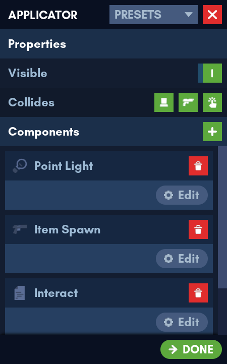
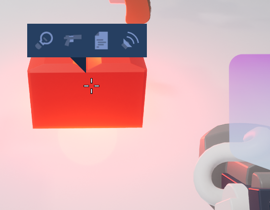

# Applicator


The Applicator is a tool for applying [Components]() to bricks. The tool is compatible with [Presets](../../../qol_features/presets/presets.md).

The current default component list includes:

- [Spot Light](../../../components/spot_light/spot_light.md)
- [Point Light](../../../components/point_light/point_light.md)
- [Audio](../../../components/audio/audio.md)
- [Item Spawn](../../../components/item_spawn/item_spawn.md)

## Getting Started

To get started, point at a brick of your choosing and left click with the Applicator tool equipped. The Applicator menu will appear.



## Brick Properties

### Visibility

The visibility of a brick can be toggled. Don't worry about not being able to see invisible bricks while editing - [all invisible bricks are shown through an effect.](../../guides/guides.md)

### Collision

Collision can be toggled on individual bricks. There are three collision channels:

-  **Player collision**
-  **Projectile collision**: Bullets, rockets
-  **Interact collision**: Clicking

## Components

You can add new components, delete existing components or edit the components of a brick.

``` admonish note
There can only be one of each component type. For example, you cannot have two Spot Lights per brick at once. You must place an additional brick for that.
```

## Duplication

When outside of the Applicator menu, you can <kbd>Ctrl</kbd>-<kbd>C</kbd> on a brick to copy its properties and components. Once you have done that, you can <kbd>Ctrl</kbd>-<kbd>V</kbd> to paste those properties and components on other bricks.

## Probing

The Applicator can also let you view existing components of a brick outside the Applicator menu, as seen in the example below.



## Default Keybindings

| Action                        | Keybinding                   |
|-------------------------------|------------------------------|
| Copy Properties & Components  | <kbd>Ctrl</kbd>-<kbd>C</kbd> |
| Paste Properties & Components | <kbd>Ctrl</kbd>-<kbd>V</kbd> |