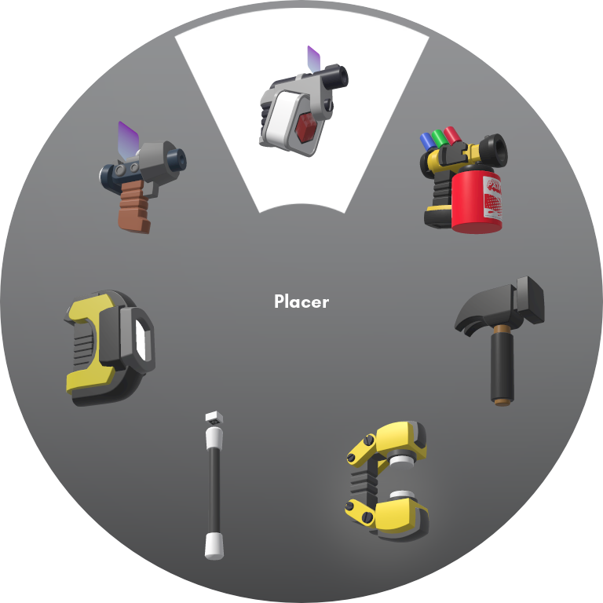

# Building: Tools

``` admonish summary
In Brickadia, there are several types of tools you can use to enhance your building experience. Currently, there are a
total of 7 building tools in the game. The most prominent ones are the Placer, Painter and Hammer.
```

## List of Tools

This is a *summary* of these tools, to view the full functionalities, **please refer to the building tools' own pages**.

1. [Placer](placer/placer.md) <kbd>Q</kbd>

: Place your bricks precisely.

2. [Painter](painter/painter.md) <kbd>E</kbd>

: Change the material and color of your bricks.

3. [Hammer](hammer/hammer.md) <kbd>X</kbd>

: Delete your bricks individually or view ownership of a brick.

4. [Resizer](resizer/resizer.md) <kbd>M</kbd>

: Resize a brick or get its size.

5. [Selector](selector/selector.md)

: Select multiple bricks at once for common operations like deletion or duplication.

6. [Applicator](applicator/applicator.md)

: Configure a brick's visibility, collision channels and apply functionality to your creations with Components.

7. [Outliner](outliner/outliner.md)

: Can only create circle guides as of now.

## Tool Pie Menu



To equip a tool from the Tool Pie Menu, hold the <kbd>G</kbd> key to open the menu and hover over the tool you want. From there, release the <kbd>G</kbd> key.


To unequip the tool in your hand, open the tools pie by holding the <kbd>G</kbd> key and select the tool on your hand. A red highlight will appear. Release the <kbd>G</kbd> key.


## Default Keybindings

| Action             | Keybinding        |
|--------------------|-------------------|
| Open Tool Pie Menu | Hold <kbd>G</kbd> |
| Equip Placer Tool  | <kbd>Q</kbd>      |
| Equip Painter Tool | <kbd>E</kbd>      |
| Equip Hammer Tool  | <kbd>X</kbd>      |
| Equip Resize Tool  | <kbd>M</kbd>      |

```admonish note
Selector, Applicator and Outliner do not have any keybindings by default.
```