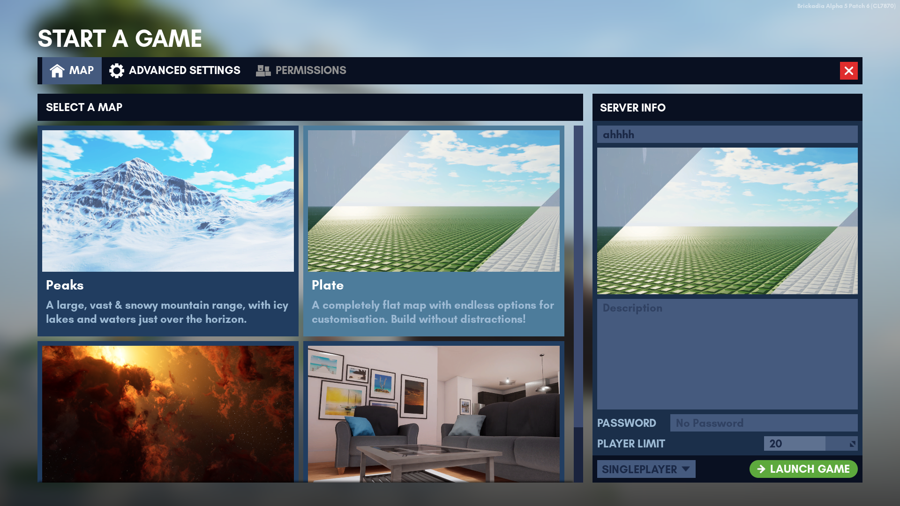

# Maps

There are currently a total of 4 maps in the game. You can select one of them from the "Start A Game" menu. From there just click "Launch Game" and you're good to go!

## Changing the Map Inside a Server

To change the map in a server, head over to the Edit Game menu while in the server. Select your desired map and click "Save and Change Map".

> [!WARNING]
> Any unsaved builds are lost if you change the map.

## List of Official Maps

| Icon                                                                                         | Name   | First added     | Description                                                                               |
|----------------------------------------------------------------------------------------------|--------|-----------------|-------------------------------------------------------------------------------------------|
|   | Plate  | Initial release | A completely flat map with endless options for customisation. Build without distractions! |
|  | Studio | Alpha 4         | A cosy summer home with carefully hidden secrets, and many places to build in.            |
|    | Peaks  | Alpha 4         | A large, vast & snowy mountain range with icy lakes and waters just over the horizon.     |
|   | Space  | Alpha 5 Patch 5 | The vast emptiness of space awaits you. Oh, and fancy nebulae!                            |