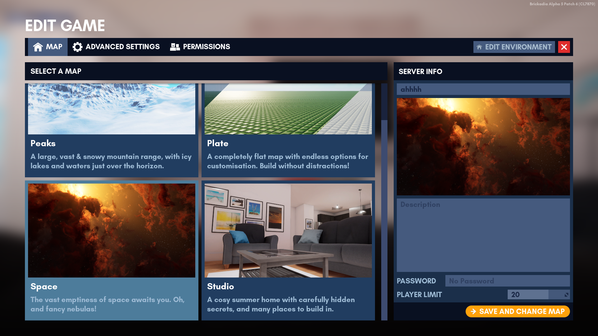

# Maps

There are currently a total of 4 maps in the game. You can select one of them from the "Start A Game" menu. From there just click "Launch Game" and you're good to go.

---
## Changing the Map While Playing

> [!NOTE]
> Permissions are required. See [Roles and Permissions](server_editing/roles.md).

To change the map while playing, head over to the Edit Game menu while playing. Select your desired map and click "Save and Change Map". This will apply to the server you are in.

> [!WARNING]
> Any unsaved builds are lost if you change the map. Make sure to notify everyone in advance before changing the map in a server.

---
## List of Official Maps

| Icon                                                                               | Name   | First added     | Description                                                                               |
|------------------------------------------------------------------------------------|--------|-----------------|-------------------------------------------------------------------------------------------|
|   | Plate  | Initial release | A completely flat map with endless options for customisation. Build without distractions! |
|  | Studio | Alpha 4         | A cosy summer home with carefully hidden secrets, and many places to build in.            |
|    | Peaks  | Alpha 4         | A large, vast & snowy mountain range with icy lakes and waters just over the horizon.     |
|   | Space  | Alpha 5 Patch 5 | The vast emptiness of space awaits you. Oh, and fancy nebulae!                            |