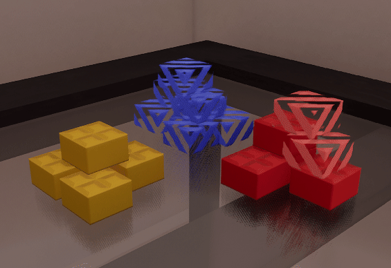

# Chapter 2: Building

## [Tools](tools.md)

## Grid

### Grid Guide


The visual grid serves as a visual reference of alignment. It adapts to the current grid size you're on. You can customize the transparency and color of it in the [General Options]().

```admonish tip
Don't want the visual grid? Setting the transparency to 0% for the grid will make it disappear completely out of sight
```

### Grid Size

You can change between grid sizes using <kbd>Num -</kbd>, except for the Brick grid size, which is only available through <kbd>Alt</kbd>.

Plate
: Dimensions of a 1x1f plate

1/2
: Half of a 1x1 plate, height is still the same as a 1x1f plate

1/5
: 2x microbrick size, half of a 1x1f plate's height

1/10
: Half of a 2x microbrick, most granular possible grid size

Brick (<kbd>Alt</kbd> only)
: The grid automatically adjusts to the size of your current brick.

## Invisible Brick Indicator

When you have a building tool equipped, the game will show all invisible bricks with this effect:

