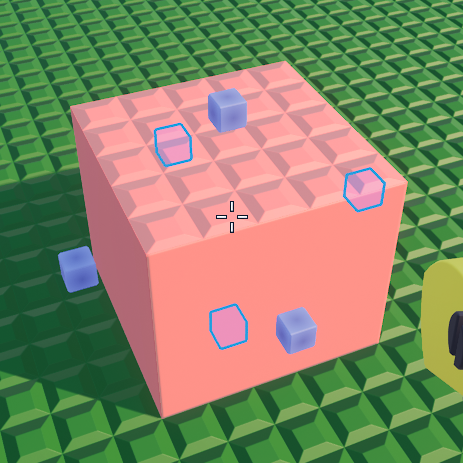

# Resizer

The Resizer is a tool for resizing bricks.

## Getting Started

To resize a brick, simply click on a brick that you want to resize. Once you have done that, you can drag the handles to resize the brick in directions.

## Brick Size Checking

To check the size of a brick with the resizer, you can press **middle click** on a brick.

## Default Keybindings

| Action                  | Keybinding                   |
|-------------------------|------------------------------|
| Get Brick Size          | Middle Click                 |
| Resize Brick to Maximum | <kbd>Ctrl</kbd> Middle Click |