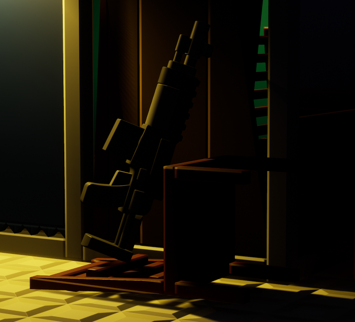

# Item Spawn

This component can spawn weapons and adjust their pick-up appearance. Compatible with [Minigames]().

## Tips for this Component

- Item spawns can be used as a way to decorate your build using the *rotation and offset* settings. Here is an example:

- Item spawns can be used in deathmatch maps as a way to add health pick-ups.