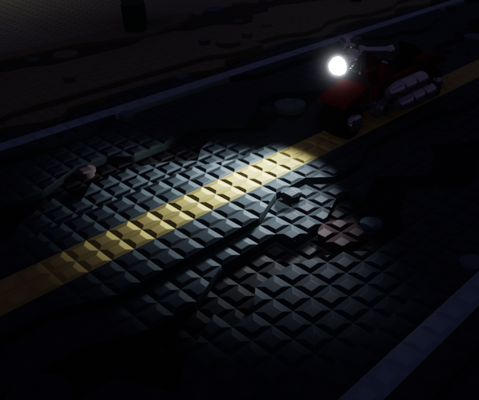
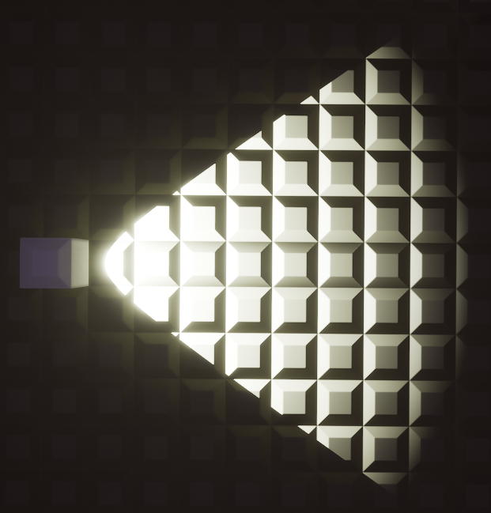

# Spot Light




This component adds a spotlight to a brick.


## Component Settings

### Basic

| Property         | Input          | Notes                                                        |
|------------------|----------------|--------------------------------------------------------------|
| Brightness       | Number (lumen) |                                                              |
| Radius           | Number (studs) |                                                              |
| Sync Brick Color | Bool           | If true, uses the brick's color and disables "Custom Color". |
| Custom Color     | Color          | See [Color Panels]() for more information.                   |

```admonish warning
Overlapping spotlights can cause performance issues on lower-end hardware.
```

### Advanced

| Property     | Input |
|--------------|-------|
| Cast Shadows | Bool  |

```admonish warning
Shadows can cause significant performance issues especially on lower-end hardware.
```

```admonish tip
If a light's shadows aren't contributing to a scene enough, disable them to save on performance.
```

### Spot Light

| Property         | Input          |
|------------------|----------------|
| Rotation         | X, Y, Z angles |
| Inner Cone Angle | Angle          |
| Outer Cone Angle | Angle          |

```admonish tip
Want a sharp appearance on a spot light? Set the Inner Cone Angle higher than the Outer Cone Angle.
```

## Tips for this Component

- Spot lights rotate with the placer's ghost preview, so their *Rotation* settings aren't affected in any way.
- Do not overlap spot lights too much as this can cause performance issues.
- If the *Inner Cone Angle* is higher than the *Outer Cone Angle*, the spotlight will produce a result like this:

