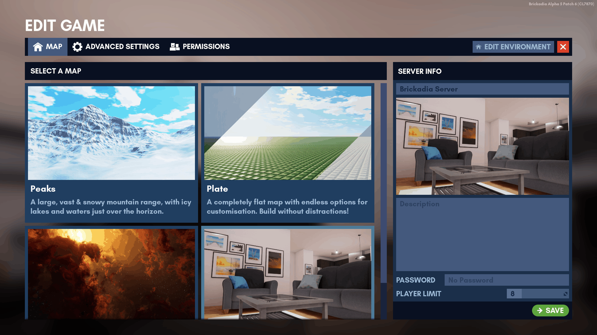

# Edit Game

**Not to be confused with [*Start a Game*](starting_a_game.md).**

This menu can be accessed from the Pause menu.

```admonish note
The *Save* button applies all settings at once, including your map, advanced settings and permission changes. 
```
``` admonish quote title="Applying server settings", collapsible=true
1. Press <kbd>Esc</kbd> to open the Pause Menu.
2. Click _Edit Game_
3. Change selected map, advanced settings and permissions as needed.
4. Check all your settings, including selected map.
5. Finalize all settings by clicking the _Save_ button.
```



## Server Info

**Requires a role with the following permission: [Edit Server Settings]()**

The panel on the right serves as a quick way to customize your server's name, description, password and player limit.  It also displays your current map as a thumbnail.

The maximum player limit is currently restricted to 30 due to known server performance issues beyond this limit.

## Changing Maps

**Requires a role with the following permission: [Change Map]()**

1. Click the _Map_ tab.
2. Head over to the Edit Game menu while playing.  
3. Select your desired map and click _Save and Change Map_.

``` admonish warning
Any unsaved builds are lost if you change the map.
```

## Advanced Settings

### In-Game

### Prefab Limits

### Selector Limits

### Auto Saving

## Permissions

**Requires a role with the following permission: [Edit Server Roles]()**