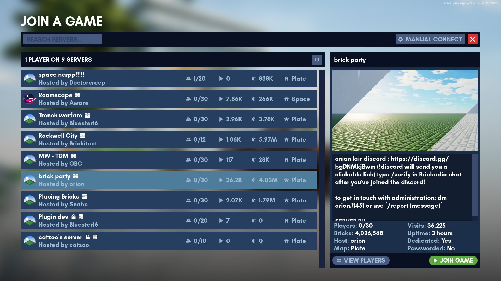

# Joining A Game

In this menu, you have a searchable server list, feature complete with server names, hoster name, descriptions  and common server statistics like active players, visits, overall brick count and map.

To get started with playing online for the first time, simply pick a server and click _Join Game_.

``` admonish note
Unlisted servers will not appear in this menu.
```



Below are the icons that can appear next to a server's name.
*  **Dedicated server:** This server will stay on even without players. Usually, they are considered running 24/7. See [Dedicated Servers]() for more information.
*  **Passworded server:** Requires a password, which is given at the discretion of the owner and can be changed at any time without notification.

``` admonish quote title="Joining a server", collapsible=true
Do one of the following:

* Double-click the server to join.
* Select the server, and press the _Join Game_ button.
```

``` admonish quote title="Manually connecting to a server", collapsible=true
1. Click _Manual Connect_ on the top right of your screen.
2. Enter the server's IP and password. Leave password blank if the server has no password.
3. Click _Join Game_.
```

``` admonish quote title="Viewing individual players in a server", collapsible=true
Click _View Players_.
**To respect account privacy settings, some player names are hidden.**
```