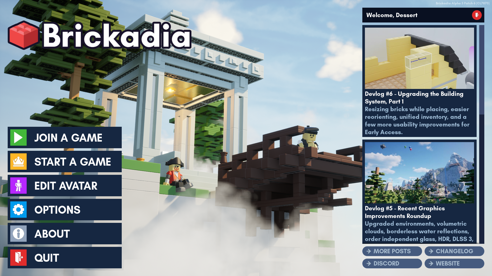

# Main Menu

**The Main Menu is central to everything that you want to do inside Brickadia.**

On the top right corner, you will see your own Brickadia user name. From there, you can log out of your current account and log in with a different account.

This is where you see blogs for the game. The Brickadia blog is known for updates and developer logs which document the progress of the game.

[Join A Game](server_list)

: Browse current servers from a list and join them.

[Start A Game](server_management.md)

: Play in single player or start your own server, complete with its own settings. **(Requires [port forwarding]())**.

[Edit Avatar]()

: Customize the look and colors of your avatar.

[Options]()

: Adjust general preferences, controls, sounds and graphics settings.

About

: Credits for Brickadia, including developers, contributors and software licenses.

Quit

: Quits the game, of course.