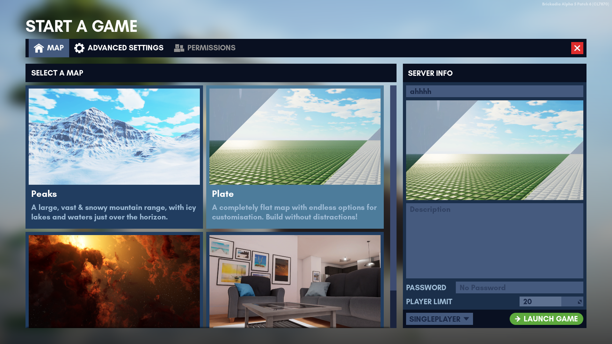
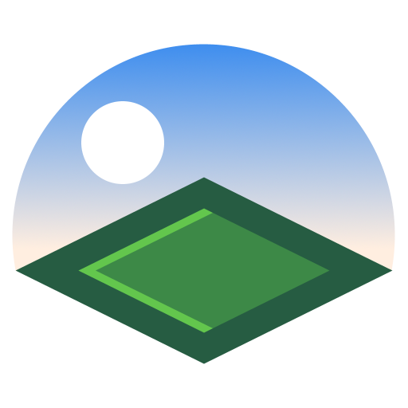
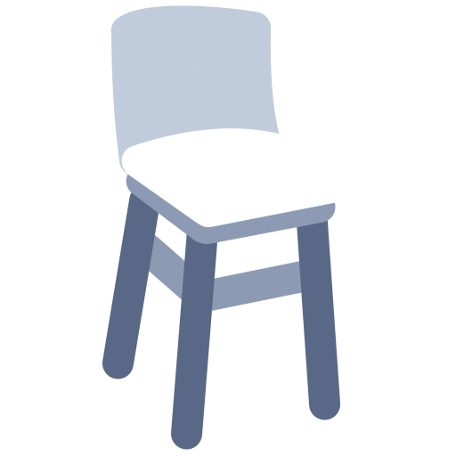

# Maps

There are currently a total of 4 maps in the game. You can select one of them from the "Start A Game" menu, or the "Edit Game" menu. Each map has different settings that may not be interchangeable with other maps at all.

```admonish tip
Label your [Presets]() according to the map name. This makes them easier to find when loading map presets.
```



## List of Official Maps

| Icon                                                                             | Name   | First added     | Description                                                                               |
|:---------------------------------------------------------------------------------|:-------|:----------------|-------------------------------------------------------------------------------------------|
|   | Plate  | Initial release | A completely flat map with endless options for customisation. Build without distractions! |
|  | Studio | Alpha 4         | A cosy summer home with carefully hidden secrets, and many places to build in.            |
|    | Peaks  | Alpha 4         | A large, vast & snowy mountain range with icy lakes and waters just over the horizon.     |
|   | Space  | Alpha 5 Patch 5 | The vast emptiness of space awaits you. Oh, and fancy nebulae!                            |