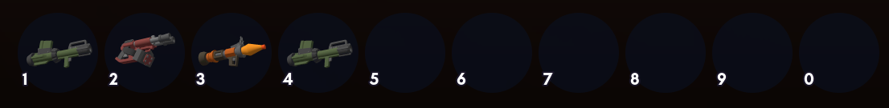

# Quickbar

The Quickbar is where you equip your current brick or item.

## How to use the Quickbar

To add an item to your Quickbar, browse the [Catalog](catalog.md) and from there, click any item you want to put it in the Quickbar.

To remove an item from your Quickbar, right-click the item in the Quickbar.

To switch the Quickbar mode in gameplay, press <kbd>Ctrl</kbd><kbd>Q</kbd> to switch between items and bricks.

The quick bar in brick mode:

The Quickbar in item mode:

This can be configured through [Minigames]().

## Default Keybindings

| Action          | Keybinding                   | Notes                                           |
|-----------------|------------------------------|-------------------------------------------------|
| Equip Slot 1-10 | <kbd>1</kbd> to <kbd>0</kbd> |                                                 |
| Next Slot       | Mouse Wheel Up               |                                                 |
| Previous Slot   | Mouse Wheel Down             |                                                 |
| Switch Mode     | <kbd>Ctrl</kbd><kbd>Q</kbd>  | Switches the Quickbar between bricks and items. |