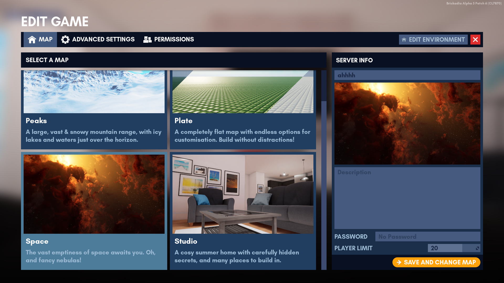

# Managing A Game

## Starting Your First Game

Brickadia can be played single player or multi player.


## Server Info

**Requires a role with the following permission: [Edit Server Settings](server_management_maps.png)**

The Server info panel (on the right) serves as a quick way to customize your server's name, description and password.  It also displays your current map as a thumbnail.

The maximum player limit is currently restricted to 30 due to known server performance issues beyond this limit.

## Changing Maps



**Requires a role with the following permission: [Change Map](server_management_maps.png)**

1. Head over to the Edit Game menu while playing.  
2. Select your desired map and click "Save and Change Map".

``` admonish warning
Any unsaved builds are lost if you change the map.
```