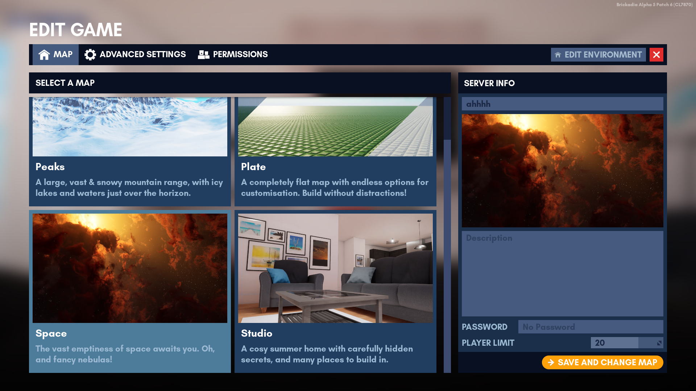

# Maps

There are currently a total of 4 maps in the game. You can select one of them from the "Start A Game" menu. From there just click "Launch Game" and you're good to go.


## List of Official Maps

| Icon                                                                | Name   | First added     | Description                                                                               |
|---------------------------------------------------------------------|--------|-----------------|-------------------------------------------------------------------------------------------|
|   | Plate  | Initial release | A completely flat map with endless options for customisation. Build without distractions! |
|  | Studio | Alpha 4         | A cosy summer home with carefully hidden secrets, and many places to build in.            |
|    | Peaks  | Alpha 4         | A large, vast & snowy mountain range with icy lakes and waters just over the horizon.     |
|   | Space  | Alpha 5 Patch 5 | The vast emptiness of space awaits you. Oh, and fancy nebulae!                            |

## Changing Maps

```admonish note
Permissions are required. See [Roles and Permissions](server_editing/roles.md).
```

Head over to the Edit Game menu while playing. Select your desired map and click "Save and Change Map". This will apply to the server you are in.

``` admonish warning
Any unsaved builds are lost if you change the map.
```

